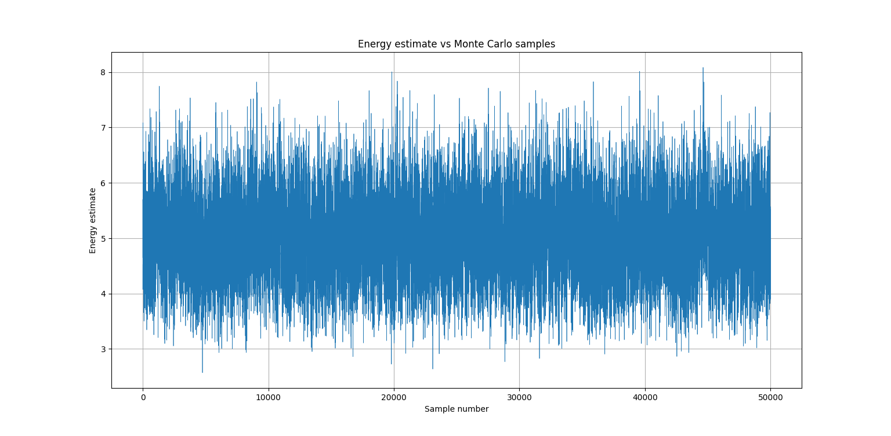
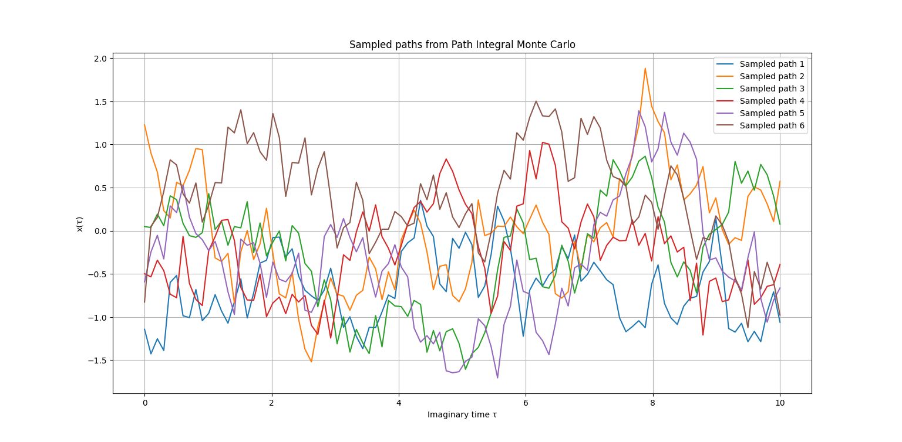

# Quantum Harmonic Oscillator

This project simulates and visualizes the quantum harmonic oscillator using Python.

## Features
- Simulation of quantum harmonic oscillator
- Visualization of energy levels and paths

## Sample Output


### Energy Levels


### Paths


## Requirements
- Python (see `.python-version` for version)
- See `qho.py` for dependencies

## Usage
Run the main script:

```bash
python qho.py
```
